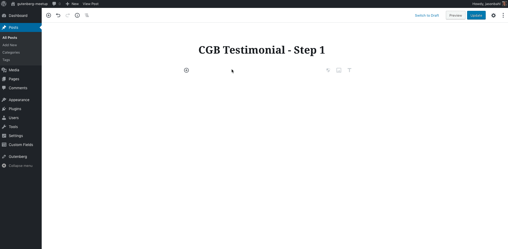
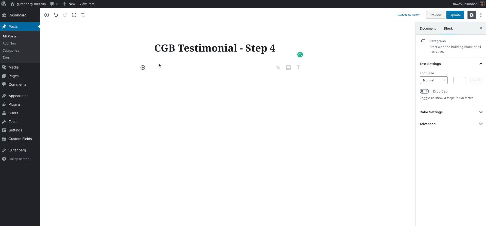
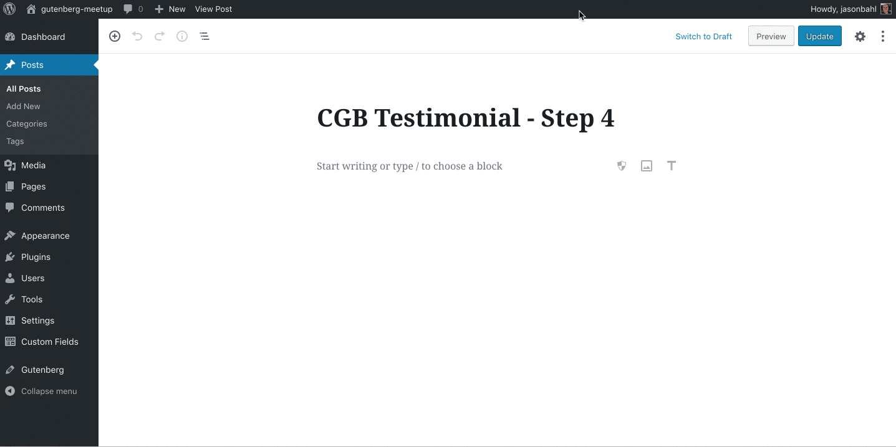
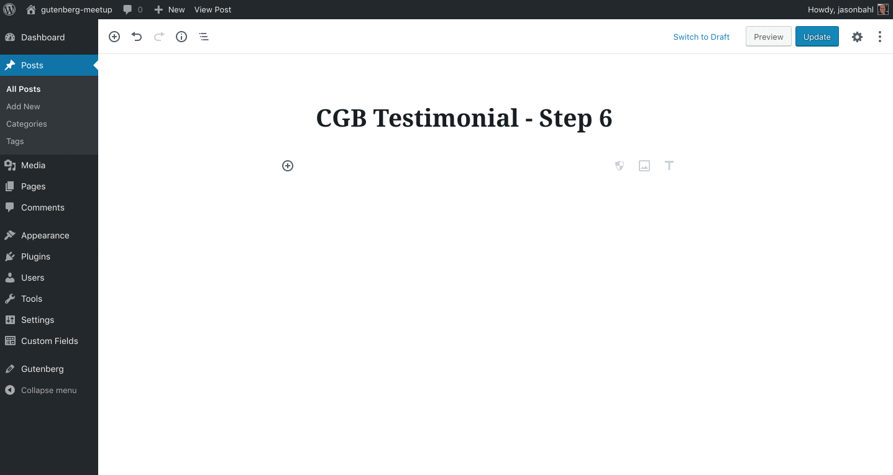

# Gutenberg Testimonial Create Guten Block Example

This is an example Testimonial Block using [Create Guten Block](https://github.com/ahmadawais/create-guten-block) by Ahmad Awais.

This block is for demonstration purposes and was created to show at the Denver WordPress Developer Meetup on November 14, 2018.

> **Note:** You must have node/npm installed locally. See the Create Guten Block docs for more info.

## Step 1: Scaffold from Create Guten Block

[See the Step 1 Diff](https://github.com/jasonbahl/gutenberg-testimonial-cgb-example/compare/7ef7cd3f5ece59dbc6508aa753db1d16f6a18147...steps/1-scaffold-from-create-guten-block)

- From the command line, navigate to the plugin directory and run the following command: `npx create-guten-block testimonial-cgb`
- This will scaffold out a new Guten Block project in a new subdirectory of the plugin `/testimonial-cgb`;

## Step 2: Move scaffolded files to project root

[See the Step 1 - Step 2 Diff](https://github.com/jasonbahl/gutenberg-testimonial-cgb-example/compare/steps/1-scaffold-from-create-guten-block...steps/2-move-files-to-root)

- Move the files from the `/testimonials-cgb` directory to the plugin root
- Add the following to `gutenberg-testimonial-cgb-example.php` below the initial plugin comment block and delete `plugin.php`

```php
// Exit if accessed directly.
if ( ! defined( 'ABSPATH' ) ) {
	exit;
}

/**
 * Block Initializer.
 */
require_once plugin_dir_path( __FILE__ ) . 'src/init.php';
```

- Start the watcher by running the following command line command from the plugin root: `npm run start` 
  - This will have WebPack compile the files and keep watching for changes so that as you actively develop
    the changes will be built on the fly so you don't have to constantly re-compile the JS files. 
    
## Step 3: Clean up block registry

[See the Step 2 - Step 3 Diff](https://github.com/jasonbahl/gutenberg-testimonial-cgb-example/compare/steps/2-move-files-to-root...steps/3-cleanup-block-registry)

Before we start using the block, let's tidy up some things in the block registry. 

Open up `/src/block/block.js` and replace the contents with the following: 

```js
import './style.scss';
import './editor.scss';

const { __ } = wp.i18n;
const { registerBlockType } = wp.blocks;

registerBlockType( 'cgb/testimonial', {
	title: __( 'Testimonial - CGB' ),
	icon: 'shield',
	category: 'common',
	keywords: [
		__( 'testimonial' ),
		__( 'create guten block Example' ),
		__( 'cgb' ),
	],
	edit: function( props ) {
		return (
			<h2>Testimonial CGB - Step 1</h2>
		);
	},
	save: function( props ) {
		return (
            <h2>Testimonial CGB - Step 1</h2>
		);
	},
} );
```



### Step 4: Initial Markup & Styles

[See the Step 3 - Step 4 Diff](https://github.com/jasonbahl/gutenberg-testimonial-cgb-example/compare/steps/3-cleanup-block-registry...steps/4-initial-markup-and-styles)

In this step we're going to scaffold our initial Markup and Styles. 

Now we can create a block in the editor and save it, but we can't edit it still.



### Step 5: Define Attributes & Add Inspector Controls

[See the Step 4 - Step 5 Diff](https://github.com/jasonbahl/gutenberg-testimonial-cgb-example/compare/steps/4-initial-markup-and-styles...steps/5-attributes-and-inspector-controls)

Here we define attributes within `registerBlockType`. The attributes are the dynamic values that will be used to modify how the block behaves. 

We also add our Inspector controls, which are form fields that can be used to interact with the block. Right now, we can interact with the controls, but they don't actually save any data. We'll work on that in the next step.



### Step 6: Make the block editable

[See the Step 5 - Step 6 Diff](https://github.com/jasonbahl/gutenberg-testimonial-cgb-example/compare/steps/5-attributes-and-inspector-controls...steps/6-make-block-editable)

In this step we wire up the inspector controls to actually modify the attributes (`setAttributes()`) and add some inline components to edit the Testimonial and name inline.

In the command line, run `npm install classnames --save` to install a utility we'll be using to add classnames to components.

